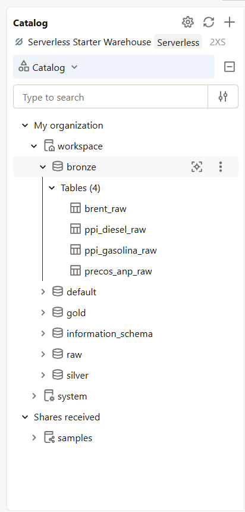
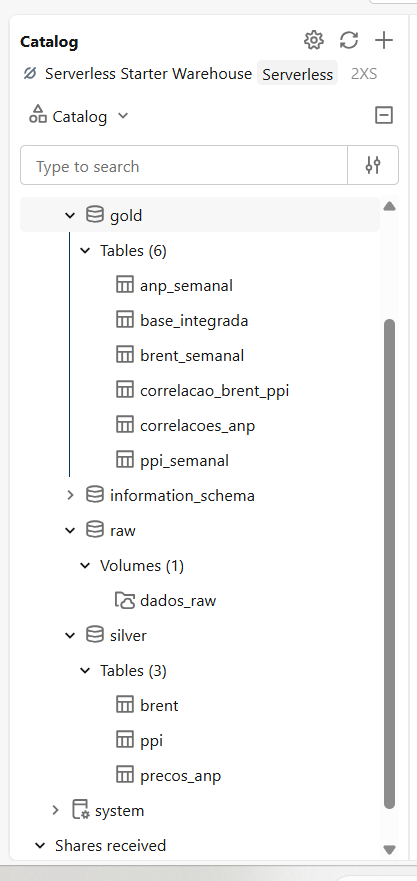

# Impactos do Choque Geopolítico de 2026 nos Preços de Combustíveis no Brasil

MVP de Engenharia de Dados desenvolvido como parte da Pós-Graduação em Ciência de Dados e Analytics da PUC-Rio.

## 1. Contexto de Negócios e Perguntas

### Contexto de Negócios

O mercado brasileiro de combustíveis está sujeito tanto a fatores internos quanto a movimentos do mercado internacional de petróleo. Alterações no preço do Brent podem afetar os preços de referência dos derivados e, posteriormente, chegar aos preços pagos pelo consumidor brasileiro. Esse processo, no entanto, não ocorre necessariamente de forma imediata ou uniforme entre diferentes combustíveis e regiões do país.

Em 28 de fevereiro de 2026, ataques militares dos Estados Unidos e de Israel contra o Irã, seguidos por ataques iranianos na região, marcaram uma escalada do conflito no Oriente Médio. Nos dias e semanas seguintes, o mercado internacional de petróleo registrou forte elevação dos preços em um contexto de redução do tráfego pelo Estreito de Ormuz, interrupções na produção regional e aumento das incertezas sobre a oferta de petróleo. 
A partir desse contexto, o projeto tem como objetivo analisar como o choque observado no mercado internacional de petróleo se relacionou com o comportamento dos preços da gasolina e do diesel no Brasil, considerando tanto os preços de referência dos derivados quanto os preços efetivamente observados ao consumidor.

Para isso, foram integradas três fontes de dados: a série histórica do preço internacional do petróleo Brent, disponibilizada pela U.S. Energy Information Administration (EIA); os dados de Preço de Paridade de Importação (PPI) de gasolina e diesel; e os dados de preços de combustíveis ao consumidor disponibilizados pela Agência Nacional do Petróleo, Gás Natural e Biocombustíveis (ANP).

A análise foi estruturada em uma arquitetura de dados com camadas Raw, Bronze, Silver e Gold. As etapas envolveram ingestão dos arquivos originais, tratamento e validação da qualidade dos dados, padronização das séries temporais, criação de agregações semanais e integração das diferentes fontes para análise.

O dia 28 de fevereiro de 2026 foi utilizado como referência para comparar o comportamento das séries antes e depois da escalada do conflito. Além da comparação entre os períodos, foram analisadas correlações e defasagens temporais entre Brent, PPI e preços ao consumidor, assim como diferenças entre combustíveis, estados e regiões brasileiras.


### Perguntas do projeto

1. Como o preço internacional do petróleo se comportou antes e depois da escalada do conflito no Oriente Médio em 2026?
2. Qual foi o comportamento dos preços de paridade de importação de gasolina e diesel durante o período?
3. As oscilações internacionais foram repassadas imediatamente aos preços dos combustíveis no Brasil?
4. Qual combustível apresentou maior sensibilidade às oscilações internacionais: gasolina ou diesel?
5. Existe defasagem temporal entre movimentos do Brent/PPI e alterações nos preços ao consumidor brasileiro?
6. O comportamento foi diferente entre estados e regiões brasileiras?
7. Houve alteração relevante no volume comercializado de gasolina, diesel e etanol após o choque?
8. O etanol apresentou comportamento diferente dos combustíveis mais diretamente relacionados ao petróleo durante o período?

As seis primeiras perguntas foram investigadas nesta versão do MVP. As questões relacionadas ao volume comercializado e ao etanol foram mantidas conforme o escopo originalmente proposto, mas não foram respondidas nesta versão e são retomadas na seção de limitações e trabalhos futuros.

### Referências do contexto
- [ONU - pronunciamento do Secretário-Geral ao Conselho de Segurança em 28/02/2026](https://www.un.org/sg/en/content/sg/statements/2026-02-28/secretary-generals-remarks-the-security-council-meeting-the-situation-the-middle-east-delivered)
- [EIA - análise dos preços do petróleo no primeiro trimestre de 2026](https://www.eia.gov/todayinenergy/detail.php?id=67424)
- [EIA - Weekly Europe Brent Spot Price FOB](https://www.eia.gov/dnav/pet/hist/rbrtew.htm)

## 2. Carga dos Dados

O projeto utiliza três conjuntos de dados principais, escolhidos para representar diferentes etapas da formação dos preços dos combustíveis: o preço internacional do petróleo Brent, os preços de paridade de importação (PPI) e os preços praticados ao consumidor brasileiro.

Os arquivos originais foram armazenados em um Volume do Databricks, utilizado como camada Raw do projeto. A partir dessa camada, os dados foram lidos e persistidos em tabelas Delta na camada Bronze, preservando os dados de origem e adicionando, quando necessário, informações de rastreabilidade da ingestão.

### 2.1 Preço internacional do petróleo Brent

A série histórica do Brent foi obtida a partir da U.S. Energy Information Administration (EIA). A base contém preços históricos do petróleo Brent e foi utilizada como referência para acompanhar o comportamento do mercado internacional.

A ingestão resultou em 9.973 registros, abrangendo o período de 20/05/1987 a 09/09/2026.

Os dados originais foram armazenados no diretório:

`/Volumes/workspace/raw/dados_raw/brent/`

Após a leitura e ingestão, os dados foram persistidos na camada Bronze para utilização nas etapas posteriores do pipeline.

**Tabela Bronze:** `workspace.bronze.brent_raw`

**Fonte:** [U.S. Energy Information Administration (EIA)](https://www.eia.gov/dnav/pet/hist/rbrtew.htm)

### 2.2 Preço de Paridade de Importação (PPI)

Os dados de Preço de Paridade de Importação foram obtidos a partir de arquivo disponibilizado pela Agência Nacional do Petróleo, Gás Natural e Biocombustíveis (ANP).

O arquivo contém séries semanais de PPI para gasolina e diesel, apresentadas para diferentes localidades. A base utilizada possui 409 semanas de observações na origem.

O arquivo original em formato Excel foi armazenado no diretório:

`/Volumes/workspace/raw/dados_raw/ppi/`

Durante a ingestão, as estruturas referentes à gasolina e ao diesel foram identificadas e tratadas separadamente antes da persistência na camada Bronze.

**Tabelas Bronze:**
- `workspace.bronze.ppi_gasolina_raw`
- `workspace.bronze.ppi_diesel_raw`

### 2.3 Preços de combustíveis ao consumidor

Os dados de preços ao consumidor também foram obtidos a partir da ANP. Essa base contém informações coletadas em postos revendedores de combustíveis, incluindo atributos como produto, data da coleta, município, estado, região, revenda, bandeira e valor de venda.

Foram utilizados 40 arquivos, que totalizaram 1.374.816 registros na ingestão.

Os arquivos originais foram armazenados no diretório:

`/Volumes/workspace/raw/dados_raw/anp_precos/`

Durante a ingestão, os arquivos foram consolidados em uma única estrutura e receberam informações adicionais de rastreabilidade, como arquivo de origem, data de ingestão e fonte. O resultado foi persistido na camada Bronze.

**Tabela Bronze:** `workspace.bronze.precos_anp_raw`

**Fonte:** [Agência Nacional do Petróleo, Gás Natural e Biocombustíveis (ANP)](https://www.gov.br/anp/pt-br)

### 2.4 Organização da camada Raw

Os arquivos de origem foram organizados no Volume seguindo a estrutura:

```text
/Volumes/workspace/raw/dados_raw/
├── brent/
├── ppi/
└── anp_precos/


## 3. Modelagem e Catálogo de Dados

A modelagem foi desenvolvida no Databricks utilizando o Unity Catalog e uma arquitetura em camadas Raw, Bronze, Silver e Gold. Essa organização permite acompanhar a evolução dos dados desde os arquivos originais até as estruturas utilizadas nas análises.

### 3.1 Modelo adotado

O projeto utiliza uma modelagem analítica por conceito, próxima ao modelo flat, dentro de uma arquitetura Lakehouse. Não foi adotado um esquema dimensional estrela ou snowflake, pois o objetivo principal do MVP é integrar séries temporais provenientes de três fontes distintas e produzir estruturas analíticas semanais para comparação entre Brent, PPI e preços ao consumidor.

As tabelas foram organizadas de acordo com sua função no pipeline:

- **Raw:** preservação dos arquivos originais no Databricks Volume;
- **Bronze:** persistência dos dados ingeridos, mantendo estrutura próxima à fonte;
- **Silver:** limpeza, padronização, tipagem e reorganização dos dados;
- **Gold:** agregações e integrações utilizadas diretamente nas análises.

A estrutura implementada foi:

```text
workspace
│
├── raw
│   └── dados_raw (Volume)
│
├── bronze
│   ├── brent_raw
│   ├── ppi_diesel_raw
│   ├── ppi_gasolina_raw
│   └── precos_anp_raw
│
├── silver
│   ├── brent
│   ├── ppi
│   └── precos_anp
│
└── gold
    ├── anp_semanal
    ├── base_integrada
    ├── brent_semanal
    ├── correlacao_brent_ppi
    ├── correlacoes_anp
    └── ppi_semanal
```

### 3.2 Organização no Unity Catalog

As tabelas foram persistidas e organizadas no Unity Catalog conforme as camadas do pipeline.

**Camada Bronze:**



**Camadas Raw, Silver e Gold:**



Os domínios apresentados nas tabelas a seguir correspondem aos valores efetivamente observados nos dados utilizados neste MVP. Portanto, representam o intervalo ou conjunto de categorias encontrado nas bases processadas e não necessariamente todos os valores possíveis nas fontes originais.

---

### 3.3 Catálogo de Dados — Bronze

A camada Bronze mantém os dados próximos à estrutura em que foram recebidos, antes das principais transformações realizadas na Silver.

#### `workspace.bronze.brent_raw`

Série diária do preço spot do petróleo Brent proveniente da U.S. Energy Information Administration (EIA).

| Campo | Tipo | Descrição | Domínio observado |
|---|---|---|---|
| `Date` | timestamp | Data da observação do preço do Brent. | 20/05/1987 a 09/09/2026 |
| `Europe_Brent_Spot_Price_FOB_Dollars_per_Barrel` | double | Preço spot do Brent FOB Europa, em dólares por barril. | US$ 9,10 a US$ 143,95 |

**Linhagem:** arquivo histórico da EIA → ingestão → `workspace.bronze.brent_raw`.

---

#### `workspace.bronze.ppi_gasolina_raw` e `workspace.bronze.ppi_diesel_raw`

As duas tabelas armazenam, respectivamente, as séries semanais de PPI de gasolina e diesel disponibilizadas pela ANP. As bases possuem a mesma estrutura e foram mantidas separadas na Bronze conforme a organização encontrada no arquivo de origem.

| Campo | Tipo | Descrição | Domínio observado |
|---|---|---|---|
| `Data` | string | Período semanal de referência conforme representação existente no arquivo de origem. | Série temporal; alta cardinalidade |
| `Manaus` | double | PPI correspondente à localidade de Manaus. | Gasolina: 0,6190–4,8948; Diesel: 1,1621–6,2886 |
| `Itaqui` | double | PPI correspondente à localidade de Itaqui. | Gasolina: 0,6330–4,8924; Diesel: 1,2721–6,3580 |
| `Suape` | double | PPI correspondente à localidade de Suape. | Gasolina: 0,6190–4,8884; Diesel: 1,2114–6,2682 |
| `Aratu` | double | PPI correspondente à localidade de Aratu. | Gasolina: 0,6210–4,8956; Diesel: 1,2618–6,3480 |
| `Santos` | double | PPI correspondente à localidade de Santos. | Gasolina: 0,6738–4,9008; Diesel: 1,3512–6,3582 |
| `Paranagua` | double | PPI correspondente à localidade de Paranaguá. | Gasolina: 0,6614–4,8862; Diesel: 1,3412–6,3809 |
| `Tramandai` | double | PPI correspondente à localidade de Tramandaí. | Gasolina: 0,6576–4,9134; Diesel: 1,3413–6,3661 |
| `Guamare` | double | PPI correspondente à localidade de Guamaré. | Gasolina: 0,6753–5,0342; Diesel: 1,2892–6,4214 |
| `Duque_de_Caxias` | double | PPI correspondente à localidade de Duque de Caxias. | Gasolina: 0,7392–5,0711; Diesel: 1,4419–6,5359 |
| `Betim` | double | PPI correspondente à localidade de Betim. | Gasolina: 0,7463–5,0907; Diesel: 1,4519–6,5574 |
| `Cubatao` | double | PPI correspondente à localidade de Cubatão. | Gasolina: 0,6824–4,9333; Diesel: 1,3654–6,3922 |
| `Maua` | double | PPI correspondente à localidade de Mauá. | Gasolina: 0,6998–4,9497; Diesel: 1,3830–6,4097 |
| `Paulinia` | double | PPI correspondente à localidade de Paulínia. | Gasolina: 0,7072–4,9898; Diesel: 1,3980–6,4551 |
| `Sao_Jose_dos_Campos` | double | PPI correspondente à localidade de São José dos Campos. | Gasolina: 0,7050–4,9770; Diesel: 1,3933–6,4388 |
| `Araucaria` | double | PPI correspondente à localidade de Araucária. | Gasolina: 0,6800–4,9424; Diesel: 1,3687–6,4403 |
| `Canoas` | double | PPI correspondente à localidade de Canoas. | Gasolina: 0,6770–4,9694; Diesel: 1,3693–6,4266 |

Cada uma das 16 localidades possui também um campo `<localidade>_variacao_pct`, do tipo `double`, correspondente à variação associada à localidade no arquivo de origem. Esses campos são:

`Manaus_variacao_pct`, `Itaqui_variacao_pct`, `Suape_variacao_pct`, `Aratu_variacao_pct`, `Santos_variacao_pct`, `Paranagua_variacao_pct`, `Tramandai_variacao_pct`, `Guamare_variacao_pct`, `Duque_de_Caxias_variacao_pct`, `Betim_variacao_pct`, `Cubatao_variacao_pct`, `Maua_variacao_pct`, `Paulinia_variacao_pct`, `Sao_Jose_dos_Campos_variacao_pct`, `Araucaria_variacao_pct` e `Canoas_variacao_pct`.

Nos dados utilizados, as variações armazenadas nesses campos ficaram aproximadamente entre **-0,3891 e 0,3926 para gasolina** e entre **-0,1366 e 0,3442 para diesel**.

**Linhagem:** arquivo PPI da ANP → separação das estruturas de gasolina e diesel → padronização dos nomes das colunas → tabelas Bronze de cada produto.

---

#### `workspace.bronze.precos_anp_raw`

Consolidação dos arquivos de preços ao consumidor da ANP, acrescida de metadados de rastreabilidade.

| Campo | Tipo | Descrição | Domínio observado |
|---|---|---|---|
| `Regiao_Sigla` | string | Região brasileira da coleta. | CO, N, NE, S, SE |
| `Estado_Sigla` | string | UF da coleta. | 27 UFs |
| `Municipio` | string | Município da revenda. | Alta cardinalidade |
| `Revenda` | string | Nome da revenda pesquisada. | Alta cardinalidade |
| `CNPJ_da_Revenda` | string | CNPJ da revenda. | Alta cardinalidade |
| `Nome_da_Rua` | string | Logradouro da revenda. | Alta cardinalidade |
| `Numero_Rua` | string | Número do endereço da revenda. | Alta cardinalidade |
| `Complemento` | string | Complemento do endereço. | Alta cardinalidade |
| `Bairro` | string | Bairro da revenda. | Alta cardinalidade |
| `Cep` | string | CEP da revenda. | Alta cardinalidade |
| `Produto` | string | Combustível pesquisado. | DIESEL, DIESEL S10, ETANOL, GASOLINA, GASOLINA ADITIVADA, GNV |
| `Data_da_Coleta` | date | Data em que o preço foi coletado. | 01/01/2025 a 31/08/2026 |
| `Valor_de_Venda` | string | Valor de venda conforme recebido na ingestão. | Alta cardinalidade |
| `Valor_de_Compra` | string | Valor de compra presente na estrutura da fonte. | Sem valores preenchidos observados |
| `Unidade_de_Medida` | string | Unidade utilizada para o preço. | R$ / litro, R$ / m³ |
| `Bandeira` | string | Bandeira da revenda. | Alta cardinalidade |
| `arquivo_origem` | string | Arquivo a partir do qual o registro foi ingerido. | Alta cardinalidade |
| `data_ingestao` | timestamp | Data e hora da execução da ingestão. | Timestamp da carga |
| `fonte` | string | Identificação da fonte dos dados. | ANP |

**Linhagem:** arquivos mensais da ANP → consolidação dos arquivos → inclusão de `arquivo_origem`, `data_ingestao` e `fonte` → `workspace.bronze.precos_anp_raw`.

---

### 3.4 Catálogo de Dados — Silver

A camada Silver contém os dados tratados e padronizados. Nessa etapa foram realizadas conversões de tipos, reorganização de estruturas e tratamento de duplicidades.

#### `workspace.silver.brent`

| Campo | Tipo | Descrição | Domínio observado |
|---|---|---|---|
| `data` | date | Data da observação do Brent, convertida para tipo `date`. | 20/05/1987 a 09/09/2026 |
| `preco_brent_usd` | double | Preço do Brent em dólares por barril. | 9,10 a 143,95 |

**Linhagem:** derivada de `workspace.bronze.brent_raw`, com padronização dos nomes e conversão da data.

---

#### `workspace.silver.ppi`

A estrutura larga das tabelas Bronze, em que cada localidade correspondia a uma coluna, foi transformada em formato longo. Gasolina e diesel passaram a compor uma única tabela.

| Campo | Tipo | Descrição | Domínio observado |
|---|---|---|---|
| `data_inicio` | date | Data inicial da semana de referência. | 05/11/2018 a 31/08/2026 |
| `data_fim` | date | Data final da semana de referência. | 09/11/2018 a 04/09/2026 |
| `localidade` | string | Localidade de referência do PPI. | 16 localidades |
| `preco` | double | Valor do PPI para produto, período e localidade. | 0,6190 a 6,5574 |
| `variacao_semanal` | double | Variação semanal conforme estrutura tratada da fonte. | -0,3891 a 0,3926 |
| `produto` | string | Produto ao qual o PPI se refere. | DIESEL, GASOLINA |
| `variacao_semanal_pct` | double | Variação semanal expressa em percentual. | -38,91% a 39,26% |

As localidades observadas são: Aratu, Araucária, Betim, Canoas, Cubatão, Duque de Caxias, Guamaré, Itaqui, Manaus, Mauá, Paranaguá, Paulínia, Santos, São José dos Campos, Suape e Tramandaí.

**Linhagem:** `workspace.bronze.ppi_gasolina_raw` + `workspace.bronze.ppi_diesel_raw` → transformação da estrutura larga para longa → separação do período em datas inicial e final → identificação do produto → consolidação em `workspace.silver.ppi`.

---

#### `workspace.silver.precos_anp`

| Campo | Tipo | Descrição | Domínio observado |
|---|---|---|---|
| `data_coleta` | date | Data da coleta do preço. | 01/01/2025 a 31/08/2026 |
| `regiao` | string | Região brasileira. | CO, N, NE, S, SE |
| `uf` | string | Unidade da Federação. | 27 UFs |
| `municipio` | string | Município da coleta. | Alta cardinalidade |
| `produto` | string | Combustível pesquisado. | DIESEL, DIESEL S10, ETANOL, GASOLINA, GASOLINA ADITIVADA, GNV |
| `valor_venda` | double | Preço de venda convertido para valor numérico. | R$ 2,77 a R$ 9,99 |
| `unidade_medida` | string | Unidade do preço. | R$ / litro, R$ / m³ |
| `bandeira` | string | Bandeira da revenda. | Alta cardinalidade |
| `cnpj_revenda` | string | CNPJ da revenda. | Alta cardinalidade |
| `revenda` | string | Nome da revenda. | Alta cardinalidade |
| `arquivo_origem` | string | Arquivo de origem do registro. | Alta cardinalidade |
| `data_ingestao` | timestamp | Timestamp da ingestão. | Timestamp da carga |
| `fonte` | string | Fonte dos dados. | ANP |

**Linhagem:** `workspace.bronze.precos_anp_raw` → seleção e padronização dos campos → conversão de `Valor_de_Venda` de texto para número → remoção das duplicidades exatas identificadas → `workspace.silver.precos_anp`.

---

### 3.5 Catálogo de Dados — Gold

A camada Gold contém as tabelas preparadas especificamente para responder às perguntas do projeto. As séries foram levadas para granularidade semanal para permitir a comparação entre fontes.

#### `workspace.gold.brent_semanal`

| Campo | Tipo | Descrição | Domínio observado |
|---|---|---|---|
| `semana` | date | Início da semana de referência. | 18/05/1987 a 07/09/2026 |
| `brent_medio_usd` | double | Preço médio do Brent na semana. | 9,44 a 141,065 |
| `brent_min_usd` | double | Menor preço diário do Brent na semana. | 9,10 a 138,40 |
| `brent_max_usd` | double | Maior preço diário do Brent na semana. | 9,70 a 143,95 |
| `dias_observados` | bigint | Número de dias com observações na semana. | 2 a 5 |

**Linhagem:** `workspace.silver.brent` → agrupamento semanal → cálculo de média, mínimo, máximo e quantidade de dias observados.

---

#### `workspace.gold.ppi_semanal`

| Campo | Tipo | Descrição | Domínio observado |
|---|---|---|---|
| `data_inicio` | date | Início da semana de referência do PPI. | 05/11/2018 a 31/08/2026 |
| `data_fim` | date | Fim da semana de referência. | 09/11/2018 a 04/09/2026 |
| `produto` | string | Produto analisado. | DIESEL, GASOLINA |
| `ppi_medio` | double | PPI médio entre as localidades na semana. | 0,6748 a 6,4007 |
| `ppi_min` | double | Menor PPI entre as localidades na semana. | 0,6190 a 6,2544 |
| `ppi_max` | double | Maior PPI entre as localidades na semana. | 0,7463 a 6,5574 |
| `localidades_observadas` | bigint | Quantidade de localidades presentes no período. | 5 a 16 |

**Linhagem:** `workspace.silver.ppi` → agrupamento por período e produto → agregação dos valores observados nas localidades.

---

#### `workspace.gold.anp_semanal`

Para a análise final foram selecionados Gasolina e Diesel S10. Na integração, Diesel S10 é associado ao combustível Diesel das séries de PPI.

| Campo | Tipo | Descrição | Domínio observado |
|---|---|---|---|
| `semana` | date | Início da semana de referência. | 30/12/2024 a 31/08/2026 |
| `produto` | string | Produto observado na base ANP. | DIESEL S10, GASOLINA |
| `preco_medio_anp` | double | Preço médio ao consumidor na semana. | 6,0855 a 7,5837 |
| `preco_min_anp` | double | Menor preço observado na semana. | 4,73 a 6,15 |
| `preco_max_anp` | double | Maior preço observado na semana. | 7,99 a 9,99 |
| `observacoes` | bigint | Quantidade de registros de preços utilizados na agregação semanal. | 852 a 4.472 |
| `ufs_observadas` | bigint | Quantidade de UFs representadas na semana. | 24 a 27 |

**Linhagem:** `workspace.silver.precos_anp` → seleção de Gasolina e Diesel S10 → agrupamento semanal e por produto → cálculo das estatísticas de preço e cobertura.

---

#### `workspace.gold.base_integrada`

Base analítica que reúne, por semana e combustível, os indicadores de preços ao consumidor, PPI e Brent.

| Campo | Tipo | Descrição | Domínio observado |
|---|---|---|---|
| `semana` | date | Semana utilizada para integração das séries. | 30/12/2024 a 31/08/2026 |
| `combustivel` | string | Combustível utilizado na integração. | DIESEL, GASOLINA |
| `preco_medio_anp` | double | Preço médio semanal ao consumidor. | 6,0855 a 7,5837 |
| `preco_min_anp` | double | Menor preço ao consumidor na semana. | 4,73 a 6,15 |
| `preco_max_anp` | double | Maior preço ao consumidor na semana. | 7,99 a 9,99 |
| `observacoes` | bigint | Quantidade de observações ANP na semana. | 852 a 4.472 |
| `ufs_observadas` | bigint | Quantidade de UFs observadas. | 24 a 27 |
| `ppi_medio` | double | PPI médio semanal. | 2,2646 a 6,4007 |
| `ppi_min` | double | Menor PPI semanal. | 2,1841 a 6,2544 |
| `ppi_max` | double | Maior PPI semanal. | 2,4198 a 6,5574 |
| `localidades_observadas` | bigint | Quantidade de localidades do PPI utilizadas. | 16 |
| `brent_medio_usd` | double | Preço médio semanal do Brent. | US$ 60,826 a US$ 124,605 |
| `brent_min_usd` | double | Menor preço do Brent na semana. | US$ 59,93 a US$ 119,56 |
| `brent_max_usd` | double | Maior preço do Brent na semana. | US$ 61,55 a US$ 138,21 |
| `dias_observados` | bigint | Quantidade de dias com cotação do Brent na semana. | 3 a 5 |

**Linhagem:** integração de `workspace.gold.anp_semanal`, `workspace.gold.ppi_semanal` e `workspace.gold.brent_semanal` pela referência temporal, harmonizando a identificação dos combustíveis para permitir a comparação das três séries.

---

#### `workspace.gold.correlacao_brent_ppi`

Resultados das correlações entre Brent e PPI considerando diferentes defasagens semanais.

| Campo | Tipo | Descrição | Domínio observado |
|---|---|---|---|
| `combustivel` | string | Combustível analisado. | DIESEL, GASOLINA |
| `relacao` | string | Relação entre as séries e janela utilizada. | Brent → PPI \| 2018–2026 |
| `lag_semanas` | bigint | Defasagem aplicada entre as séries. | 0 a 4 semanas |
| `correlacao` | double | Coeficiente de correlação calculado. | -0,0564 a 0,6904 |
| `n` | bigint | Número de pares de observações utilizados no cálculo. | 402 a 408 |

**Linhagem:** séries semanais de Brent e PPI → alinhamento temporal → aplicação de defasagens de 0 a 4 semanas → cálculo das correlações.

---

#### `workspace.gold.correlacoes_anp`

Resultados das correlações envolvendo os preços ao consumidor na janela temporal comum às séries.

| Campo | Tipo | Descrição | Domínio observado |
|---|---|---|---|
| `combustivel` | string | Combustível analisado. | DIESEL, GASOLINA |
| `relacao` | string | Relação entre as séries analisadas. | Brent → ANP \| janela comum; PPI → ANP \| janela comum |
| `lag_semanas` | bigint | Defasagem aplicada entre as séries. | 0 a 4 semanas |
| `correlacao` | double | Coeficiente de correlação calculado. | -0,0705 a 0,6555 |
| `n` | bigint | Número de pares de observações utilizados no cálculo. | 83 a 87 |

**Linhagem:** séries semanais integradas → seleção da janela temporal comum → aplicação de defasagens de 0 a 4 semanas → cálculo das correlações envolvendo os preços ao consumidor.

### 3.6 Resumo da linhagem

De forma simplificada, a linhagem principal do pipeline é:

```text
EIA Brent
   │
   ▼
bronze.brent_raw
   │
   ▼
silver.brent
   │
   ▼
gold.brent_semanal ───────────────┐
                                  │
ANP PPI                           │
   │                              │
   ├─► bronze.ppi_gasolina_raw    │
   └─► bronze.ppi_diesel_raw      │
              │                   │
              ▼                   │
          silver.ppi              │
              │                   │
              ▼                   │
       gold.ppi_semanal ──────────┼─► gold.base_integrada
              │                   │
              └─► gold.correlacao_brent_ppi
                                  │
ANP Preços                        │
   │                              │
   ▼                              │
bronze.precos_anp_raw             │
   │                              │
   ▼                              │
silver.precos_anp                 │
   │                              │
   ▼                              │
gold.anp_semanal ─────────────────┘
   │
   └───────────────────────────────► gold.correlacoes_anp
```

A separação entre as camadas permite preservar os dados de origem, aplicar transformações de forma rastreável e disponibilizar estruturas específicas para as análises finais.


## 4. Pipeline de Dados

O pipeline foi desenvolvido em notebooks no Databricks utilizando principalmente Python, PySpark e SQL.

Os notebooks foram separados por responsabilidade, acompanhando o fluxo dos dados desde a preparação do ambiente até a análise final:

1. **Setup do ambiente:** criação dos schemas `raw`, `bronze`, `silver` e `gold`, além do Volume utilizado para armazenamento dos arquivos originais.
2. **Ingestão do Brent:** leitura da série histórica e persistência na camada Bronze.
3. **Ingestão do PPI:** leitura do arquivo Excel, identificação das estruturas de gasolina e diesel, padronização inicial e persistência das duas tabelas Bronze.
4. **Ingestão dos preços ANP:** leitura e consolidação dos arquivos de preços ao consumidor, com inclusão de informações de rastreabilidade.
5. **Profiling e transformação Bronze → Silver:** avaliação da qualidade, conversão de tipos, tratamento das estruturas e remoção de duplicidades.
6. **Modelagem Silver → Gold:** criação das séries semanais, integração das fontes e cálculo das correlações e defasagens.
7. **Análise dos resultados:** comparação dos períodos anterior e posterior ao choque, análise dos combustíveis e avaliação das diferenças regionais.

O fluxo geral pode ser representado da seguinte forma:

```text
Arquivos originais
       │
       ▼
      Raw
       │
       ▼
    Bronze
       │
       ▼
    Silver
       │
       ▼
      Gold
       │
       ▼
Análises e resultados
```

A divisão em notebooks e camadas facilita a compreensão do fluxo e permite executar separadamente as etapas de ingestão, transformação, modelagem e análise.


## 5. Qualidade de Dados

A qualidade dos dados foi avaliada durante a transformação da camada Bronze para Silver. Foram realizadas verificações de quantidade de registros, tipos de dados, valores nulos, conversões e duplicidades.

### 5.1 Brent

A ingestão do Brent resultou em **9.973 registros**. A quantidade de registros foi comparada entre a fonte carregada e a tabela Bronze, garantindo que não houvesse perda de linhas durante a persistência.

### 5.2 PPI

Após a transformação para formato longo e consolidação de gasolina e diesel, a tabela Silver do PPI ficou com **12.142 registros**, sendo:

- **6.071 registros de gasolina**;
- **6.071 registros de diesel**.

Foram realizadas verificações nos campos essenciais `data_inicio`, `data_fim`, `produto`, `localidade` e `preco`, não sendo encontrados valores nulos nesses campos.

Também foi verificada a existência de duplicidades considerando a combinação de período, produto e localidade. O resultado foi de **zero combinações duplicadas** na tabela Silver.

### 5.3 Preços ANP

A camada Bronze dos preços ao consumidor possui **1.374.816 registros**.

Durante o tratamento, foram identificados **6 grupos com duplicidade**, correspondentes a **6 linhas duplicadas excedentes**. Após a remoção dessas duplicidades, a camada Silver passou a possuir **1.374.810 registros**.

A conversão do campo de valor de venda para formato numérico também foi validada. Não foram encontrados valores preenchidos na origem que se tornassem nulos em decorrência da conversão.

Dessa forma, a diferença entre as quantidades das camadas Bronze e Silver é explicada integralmente pela remoção das seis linhas duplicadas identificadas.


## 6. Análise de Dados

Para analisar o impacto do choque de 2026, o dia **28 de fevereiro de 2026** foi adotado como data de referência. Foram comparadas janelas anteriores e posteriores ao evento, além de serem analisadas correlações contemporâneas e com defasagens semanais.

As análises apresentadas são descritivas e correlacionais. Portanto, as associações encontradas entre as séries não são interpretadas isoladamente como evidência de causalidade.

### 6.1 Comportamento do Brent

Na janela analisada, o preço médio semanal do Brent passou de aproximadamente **US$ 66,64 por barril** no período anterior para **US$ 110,28** no período posterior à data de referência, representando uma elevação de aproximadamente **65,48%**.

O maior valor médio semanal observado no período posterior foi de aproximadamente **US$ 124,61 por barril**, na semana de 06/04/2026.

O resultado evidencia uma mudança expressiva no nível de preços internacionais após a escalada do conflito.

### 6.2 Comportamento do PPI

Os preços de paridade de importação também apresentaram aumento na comparação entre as 12 semanas anteriores e as 12 semanas posteriores à data de referência.

Para o **diesel**, a média passou de aproximadamente **3,26 para 5,64**, uma variação de **73,15%**.

Para a **gasolina**, a média passou de aproximadamente **2,42 para 3,98**, uma variação de **64,22%**.

Nesse recorte específico, portanto, o aumento percentual do PPI foi maior para o diesel.

### 6.3 Preços ao consumidor

Os preços observados pela ANP também aumentaram, mas em proporção inferior às variações observadas no Brent e no PPI.

O **Diesel S10** apresentou aumento médio de aproximadamente **18,08%**, passando de 6,14 para 7,25.

A **gasolina** apresentou aumento médio de aproximadamente **6,32%**, passando de 6,28 para 6,68.

A diferença de magnitude entre as etapas indica que as oscilações internacionais não foram reproduzidas de maneira imediata e proporcional nos preços ao consumidor.

### 6.4 Sensibilidade de gasolina e diesel

A comparação entre gasolina e diesel depende da etapa da cadeia e da janela analisada.

No choque de 2026, o diesel apresentou maior variação percentual tanto no PPI quanto nos preços ao consumidor.

Na análise histórica entre Brent e PPI, entretanto, a correlação contemporânea foi maior para a gasolina (**0,690**) do que para o diesel (**0,588**).

Esses resultados mostram que a ideia de "maior sensibilidade" depende da métrica considerada. O comportamento durante o evento específico e a associação histórica entre as séries representam perspectivas diferentes do problema.

### 6.5 Defasagens temporais

Foram calculadas correlações considerando diferentes defasagens semanais.

Na comparação entre **PPI e preços ao consumidor**, a associação mais forte ocorreu com uma semana de defasagem:

- Diesel: aproximadamente **0,656**;
- Gasolina: aproximadamente **0,479**.

Na comparação entre **Brent e preços ao consumidor**, a correlação também foi mais elevada com uma semana de defasagem:

- Diesel: aproximadamente **0,470**;
- Gasolina: aproximadamente **0,408**.

Os resultados sugerem que, na janela analisada, as alterações das referências internacionais apresentaram associação mais forte com os preços ao consumidor quando considerada aproximadamente uma semana de defasagem. Essa evidência deve ser interpretada como associação temporal, e não como demonstração de causalidade.

### 6.6 Diferenças regionais

A análise regional mostrou que o impacto não foi uniforme no território brasileiro.

Para o **Diesel S10**, as variações médias observadas foram:

- Centro-Oeste: **18,27%**;
- Norte: **15,00%**;
- Nordeste: **20,07%**;
- Sul: **17,89%**;
- Sudeste: **17,74%**.

Para a **gasolina**, foram:

- Centro-Oeste: **3,31%**;
- Norte: **6,72%**;
- Nordeste: **10,22%**;
- Sul: **4,07%**;
- Sudeste: **6,05%**.

Também foram observadas diferenças relevantes entre as unidades da federação. No Diesel S10, as variações ficaram entre aproximadamente **7,87% no Acre e 27,26% na Bahia**. Na gasolina, ficaram entre aproximadamente **1,09% no Distrito Federal e 12,85% na Bahia**.

Um exemplo da heterogeneidade entre combustíveis aparece no Distrito Federal: o Diesel S10 apresentou aumento de aproximadamente **20,73%**, enquanto a gasolina apresentou aumento de aproximadamente **1,09%**.

### 6.7 Síntese dos resultados

Em conjunto, os resultados mostram uma forte elevação do Brent após a data de referência, acompanhada por aumentos do PPI de gasolina e diesel. Os preços ao consumidor também aumentaram, mas em intensidade menor.

As análises de correlação indicaram associações temporais entre as séries e mostraram que, na janela comum analisada, as correlações com os preços ao consumidor foram mais fortes com aproximadamente uma semana de defasagem.

O comportamento também não foi homogêneo entre os combustíveis nem entre regiões e estados brasileiros. Isso reforça que a transmissão das oscilações internacionais para o mercado doméstico envolve diferentes etapas e não pode ser representada apenas pela comparação direta entre o Brent e o preço final nos postos.


## 7. Limitações e Trabalhos Futuros

O escopo originalmente proposto incluía também a análise do volume comercializado de gasolina, diesel e etanol e uma comparação específica do comportamento do etanol com os combustíveis mais diretamente relacionados ao petróleo.

Essas duas questões não foram respondidas nesta versão do MVP. Sua inclusão exigiria a incorporação de novas fontes de dados e novas etapas de ingestão, tratamento, modelagem e validação, ampliando significativamente o pipeline desenvolvido.

As perguntas foram mantidas no objetivo original para preservar o escopo inicialmente proposto e registrar possibilidades de continuidade do trabalho.

Como evolução futura, o projeto poderá incorporar dados de comercialização de combustíveis e séries específicas de etanol. Isso permitirá avaliar se o choque observado nos preços também esteve associado a mudanças no volume comercializado e investigar o comportamento de um combustível cuja dinâmica de formação de preços possui características diferentes das de gasolina e diesel.

Outras possibilidades de evolução incluem ampliar a janela temporal de análise, incorporar outras variáveis econômicas relevantes e aplicar métodos de séries temporais capazes de investigar de forma mais aprofundada as relações entre as diferentes etapas da formação dos preços.


## 8. Autoavaliação

O desenvolvimento deste MVP permitiu aplicar conceitos de Engenharia de Dados em um problema real, envolvendo fontes com formatos, granularidades e estruturas diferentes.

Um dos principais desafios foi tornar comparáveis as três bases utilizadas. Enquanto o Brent apresenta uma série histórica de preços internacionais, o PPI possui estrutura semanal distribuída por localidades e os dados da ANP possuem grande volume e granularidade de preços coletados em revendedores. A construção das camadas Silver e Gold foi importante para padronizar essas estruturas antes da análise.

Outro ponto relevante foi a preocupação com a qualidade e a rastreabilidade dos dados. A comparação das quantidades entre as etapas, a verificação de valores nulos, a validação das conversões e a identificação das duplicidades permitiram entender e justificar as alterações ocorridas entre Bronze e Silver.

A criação das séries semanais e da camada Gold também permitiu separar o tratamento dos dados das análises finais, tornando o fluxo mais organizado e reutilizável.

Nem todas as perguntas inicialmente propostas puderam ser respondidas nesta versão. As análises de volume comercializado e etanol exigiriam novas fontes e uma ampliação do pipeline. A decisão foi manter essas perguntas documentadas e priorizar a conclusão e validação das etapas já desenvolvidas, em vez de incorporar novas bases sem o mesmo nível de tratamento e verificação.

Como aprendizado, o projeto reforçou a importância de definir claramente a granularidade dos dados, validar cada etapa do pipeline e documentar as transformações realizadas. Em uma próxima evolução, além da inclusão das bases faltantes, seria interessante aprofundar a análise temporal e avaliar métodos adicionais para investigar as relações entre as séries.


## 9. Estrutura do Repositório

```text
mvp_engenharia_dados/
│
├── README.md
├── notebooks/
│   ├── 00_setup.ipynb
│   ├── 01_ingestao_brent.ipynb
│   ├── 02_ingestao_ppi.ipynb
│   ├── 03_ingestao_precos_anp.ipynb
│   ├── 04_profiling_qualidade_bronze.ipynb
│   ├── 05_modelagem_gold.ipynb
│   └── 06_analise_choque_geopolitico_resultados.ipynb
│
└── imagens/
    ├── catalog_bronze.png
    └── catalog_gold_silver_raw.png
```

Os notebooks seguem a ordem de execução do pipeline, desde a preparação do ambiente e ingestão das fontes até a criação das tabelas analíticas e interpretação dos resultados.  
